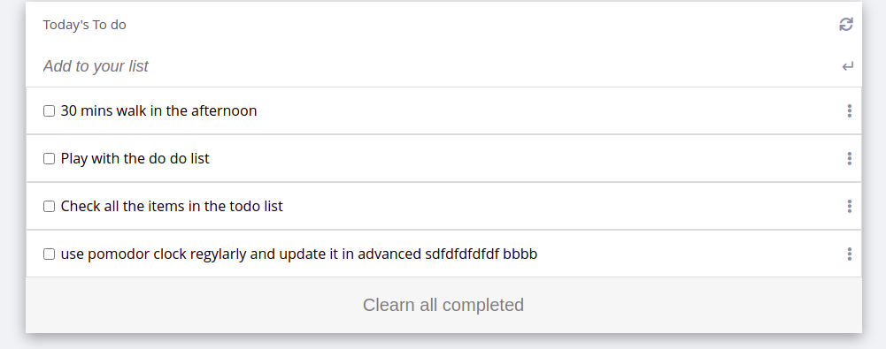

# TODO LIST: ToDo's List.

> This project is about Todo list.

## Built With

- Html&Css
- Linters.
- Webpack.
## Live Demo

The live page is:
[Live Link](https://aakbarkhan.github.io/Portfolio/)

## Getting Started

- To get a local copy up and running follow these simple example steps.

- follow using [webpack-dev-server](https://webpack.js.org/guides/development/#using-webpack-dev-server) guide and set it up on your local machine.
- npm run build in your dir.
## Authors

👤 **Aku**

- GitHub: [@aakbarkhan](https://github.com/aakbarkhan)

## 🤝 Contributing

Contributions, issues, and feature requests are welcome!

Feel free to check the [issues page](../../issues/).

## Show your support

Give a ⭐️ if you like this project!

## Acknowledgments

- Microverse partners.
- Standup teams.

## 📝 License

This project is [MIT](./MIT.md) licensed.
